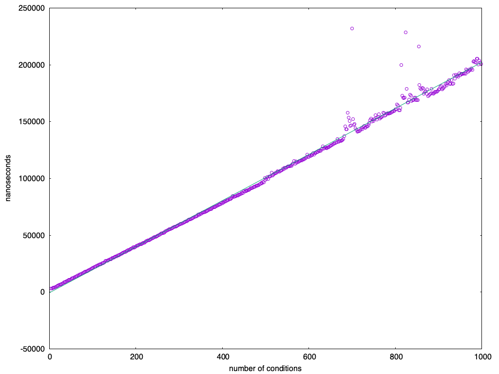

# Hard fork 2 condition costs

As part of hard fork 2, the consensus rules for limits to conditions were changed.

Prior to hard fork 2, every CoinSpend could emit any number of conditions, but
no more than 1024 _announcement_ conditions (including messages, create and
assert announcements).

Once the hard fork has activated, the 1024 limit is removed. Instead all
conditions after the 100 first (per CoinSpend) have an additional cost of 500
applied. This applies to all conditions, whether they are known or unknown,
including the `SOFTFORK` condition as well as `CREATE_COIN` and `AGG_SIG_*`
conditions.

The cost per condition was established by benchmarking the `AGG_SIG_*`
conditions, knowing their cost to be 1800000, compute the cost per nanosecond
and then apply that on all other conditions, to estimate what a proportional
cost would be. iDifferent systems vary widely in the proportions of actual CPU
cost, but the benchmark gives some guidance. The cost of 500 was in the upper
end among conditions that are expensive.

The following are the benchmarks for a few different systems:

## Threadripper

```
condition: 49 nano-per-cond: 677972.916 cost-per-nanosecond: 1.770
condition: 50 nano-per-cond: 671905.156 cost-per-nanosecond: 1.786
condition: 43 nano-per-cond: 675518.102 cost-per-nanosecond: 1.776
condition: 44 nano-per-cond: 680348.959 cost-per-nanosecond: 1.764
condition: 45 nano-per-cond: 667876.463 cost-per-nanosecond: 1.797
condition: 47 nano-per-cond: 668400.500 cost-per-nanosecond: 1.795
condition: 48 nano-per-cond: 669700.376 cost-per-nanosecond: 1.792
condition: 46 nano-per-cond: 666194.337 cost-per-nanosecond: 1.801
condition:  1 nano-per-cond:  7.732 computed-cost: 13.80
condition: 70 nano-per-cond: 43.477 computed-cost: 77.61
condition: 71 nano-per-cond: 55.557 computed-cost: 99.18
condition: 72 nano-per-cond: 60.761 computed-cost: 108.47
condition: 73 nano-per-cond: 36.580 computed-cost: 65.30
condition: 75 nano-per-cond: 51.860 computed-cost: 92.58
condition: 74 nano-per-cond: 61.210 computed-cost: 109.27
condition: 80 nano-per-cond: 62.217 computed-cost: 111.07
condition: 81 nano-per-cond: 68.105 computed-cost: 121.58
condition: 82 nano-per-cond: 56.412 computed-cost: 100.70
condition: 83 nano-per-cond: 40.627 computed-cost: 72.53
condition: 84 nano-per-cond: 70.653 computed-cost: 126.13
condition: 85 nano-per-cond: 48.299 computed-cost: 86.22
condition: 86 nano-per-cond: 51.227 computed-cost: 91.45
condition: 87 nano-per-cond: 30.290 computed-cost: 54.07
condition: 90 nano-per-cond: 67.463 computed-cost: 120.43
condition: 66 nano-per-cond: 222.322 computed-cost: 396.88
condition: 61 nano-per-cond: 46.482 computed-cost: 82.98
condition: 63 nano-per-cond: 92.362 computed-cost: 164.88
```

## MacBook M1

```
condition: 49 nano-per-cond: 454014.196 cost-per-nanosecond: 2.643
condition: 50 nano-per-cond: 456755.449 cost-per-nanosecond: 2.627
condition: 43 nano-per-cond: 473450.296 cost-per-nanosecond: 2.535
condition: 44 nano-per-cond: 449283.602 cost-per-nanosecond: 2.671
condition: 45 nano-per-cond: 447728.869 cost-per-nanosecond: 2.680
condition: 47 nano-per-cond: 457000.927 cost-per-nanosecond: 2.626
condition: 48 nano-per-cond: 451901.076 cost-per-nanosecond: 2.655
condition: 46 nano-per-cond: 467285.682 cost-per-nanosecond: 2.568
condition:  1 nano-per-cond:  9.712 computed-cost: 25.50
condition: 70 nano-per-cond: 17.911 computed-cost: 47.03
condition: 71 nano-per-cond: 20.092 computed-cost: 52.76
condition: 72 nano-per-cond: 20.667 computed-cost: 54.26
condition: 73 nano-per-cond: 18.802 computed-cost: 49.37
condition: 75 nano-per-cond: 16.816 computed-cost: 44.15
condition: 74 nano-per-cond: 17.290 computed-cost: 45.40
condition: 80 nano-per-cond: 17.972 computed-cost: 47.19
condition: 81 nano-per-cond: 16.962 computed-cost: 44.54
condition: 82 nano-per-cond: 20.250 computed-cost: 53.17
condition: 83 nano-per-cond: 16.390 computed-cost: 43.03
condition: 84 nano-per-cond: 17.378 computed-cost: 45.63
condition: 85 nano-per-cond: 22.856 computed-cost: 60.01
condition: 86 nano-per-cond: 16.739 computed-cost: 43.95
condition: 87 nano-per-cond: 17.353 computed-cost: 45.56
condition: 90 nano-per-cond: 18.558 computed-cost: 48.73
condition: 66 nano-per-cond: 203.020 computed-cost: 533.06
condition: 61 nano-per-cond: 30.418 computed-cost: 79.87
condition: 63 nano-per-cond: 26.608 computed-cost: 69.86
```

## RaspberryPI 5

```
condition: 49 nano-per-cond: 2685105.966 cost-per-nanosecond: 0.447
condition: 50 nano-per-cond: 2685827.649 cost-per-nanosecond: 0.447
condition: 43 nano-per-cond: 2685499.354 cost-per-nanosecond: 0.447
condition: 44 nano-per-cond: 2685505.557 cost-per-nanosecond: 0.447
condition: 45 nano-per-cond: 2685482.575 cost-per-nanosecond: 0.447
condition: 47 nano-per-cond: 2685539.063 cost-per-nanosecond: 0.447
condition: 48 nano-per-cond: 2685623.201 cost-per-nanosecond: 0.447
condition: 46 nano-per-cond: 2685648.551 cost-per-nanosecond: 0.447
condition:  1 nano-per-cond: 21.042 computed-cost: 9.40
condition: 70 nano-per-cond: 37.302 computed-cost: 16.67
condition: 71 nano-per-cond: 43.307 computed-cost: 19.35
condition: 72 nano-per-cond: 43.621 computed-cost: 19.49
condition: 73 nano-per-cond: 59.459 computed-cost: 26.57
condition: 75 nano-per-cond: 53.030 computed-cost: 23.70
condition: 74 nano-per-cond: 60.699 computed-cost: 27.12
condition: 80 nano-per-cond: 60.826 computed-cost: 27.18
condition: 81 nano-per-cond: 59.639 computed-cost: 26.65
condition: 82 nano-per-cond: 53.410 computed-cost: 23.87
condition: 83 nano-per-cond: 52.470 computed-cost: 23.45
condition: 84 nano-per-cond: 60.478 computed-cost: 27.02
condition: 85 nano-per-cond: 59.610 computed-cost: 26.64
condition: 86 nano-per-cond: 53.261 computed-cost: 23.80
condition: 87 nano-per-cond: 52.935 computed-cost: 23.65
condition: 90 nano-per-cond: 59.988 computed-cost: 26.81
condition: 66 nano-per-cond: 399.152 computed-cost: 178.36
condition: 61 nano-per-cond: 71.930 computed-cost: 32.14
condition: 63 nano-per-cond: 61.307 computed-cost: 27.39
```

## Linear cost

To validate that the cost increase is in fact linear to the number of
conditions, each condition was measured in spends ranging from 1 to 500
condition, expecting CPU time to increase linearly with the number of
conditions to parse.

This turned out to be the case.


